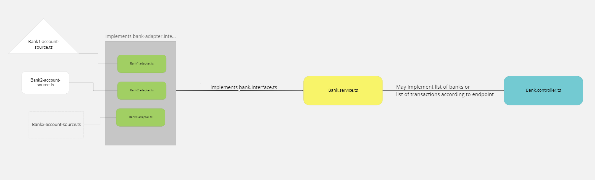

## Description

Small POC developed as a challenge regarding the developers ability to work with abstraction layers and design patterns

This project was made in two parts:

##### 1. Back-end

Developed with node and nest.js; The reference classes were translated to typescript with just a few adjustments (just enums and primitive types) to fit properly.

##### 2. Front-end

Made with vue and vuetify; Even though it was not a part of the inicial prompt, this was included as a small extra to consume the data being outputed by the endpoints created on part 1 and it is possible to sort said data by any key, as well as choosing between dark and light modes. Vue 2 was used instead of 3 for compatibility reasons (vuetify 3 is still in beta).

## How it works

Every design/architecture decision was made with scalability in mind, making it quite easy to add new banks or disable already implemented ones as necessary. All data coming from proprietary classes (or any other sources in the future) should follow this structure:


This implementation heavily uses [typescript interfaces](https://www.typescriptlang.org/docs/handbook/interfaces.html) to enforce compatibility among different classes. It also relies on [Jest](https://jestjs.io) for Unity testing of key components such as controllers and adapters

## Relevant files

```bash
├── client
│   └── src
│       ├── App.vue #front-end component
│       └── components
│           └── BankView.vue #data visualization
├── src
│   ├── adapters
│   │   ├── bank**.adapter.ts #abstraction classes intermediating the service layer and client calls
│   │   └── **.adapter.spec.ts #unit tests relevant to the abstraction layer
│   ├── bank
│   │   ├── bank.controller.spec.ts #unit tests regarding API calls
│   │   ├── bank.controller.ts #class regarding the endpoints created for this challenge
│   │   └── bank.service.ts #service layer made to group data fetched from multiple adapters into a standardized object
│   ├── bank1
│   │   ├── bank1-**.ts #bank1 proprietary classes
│   ├── bank2
│   │   ├── bank2-**.ts #bank2 proprietary classes
│   ├── interfaces
│   │   ├── **.interface.ts #all interfaces used
│   ├── app.module.ts
│   └── main.ts
├── .env #list of implemented banks and path to api mock (unused)
└── README.md #You are here!

```

## Installation

```bash
$ npm install
# Note that this already installs and builds everything necessary on both parts, thanks to npm prepare
```

## Running the app

```bash
# development
$ npm run start

# watch mode
$ npm run start:dev

# production mode
$ npm run start:prod
```

## Test

```bash
# unit tests
$ npm run test

# test coverage
$ npm run test:cov
```

## How to access

While running, there are 3 endpoints exposed via GET:

```bash
http://localhost:3000/api/bank # List of banks implemented
http://localhost:3000/api/bank/balances # Name, current balance and currency used on said banks
http://localhost:3000/api/bank/transactions # History of transactions on said banks
```

as well as one URL to access the application:

```bash
http://localhost:3000/
```

This is possible because the script builds the front-end bundle after an `npm install` and stores it on `client/dist`, to be served by Nest's [serve-static](https://docs.nestjs.com/recipes/serve-static).

## Stay in touch

- Author - [Rick Palmeira](https://rickpalmeira.dev)
- Github - [@rickinbsb](https://github.com/rickinbsb)
- Twitter - [@rickpalmeira\_](https://twitter.com/rickpalmeira_)
- Linkedin - [Pedro Palmeira](https://linkedin.com/in/rickinbsb/)
- Mail - [rickinbsb@gmail.com](mailto:rickinbsb@gmail.com)
- Whatsapp - [+55 61 99326-8419](https://api.whatsapp.com/send/?phone=55061993268419&app_absent=0)
